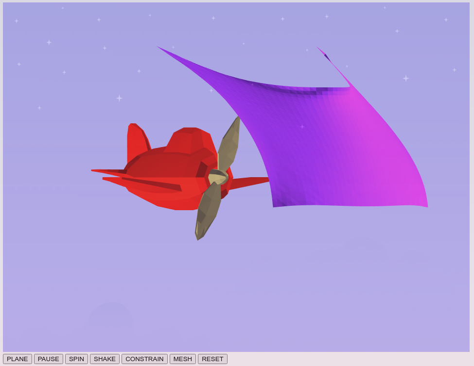
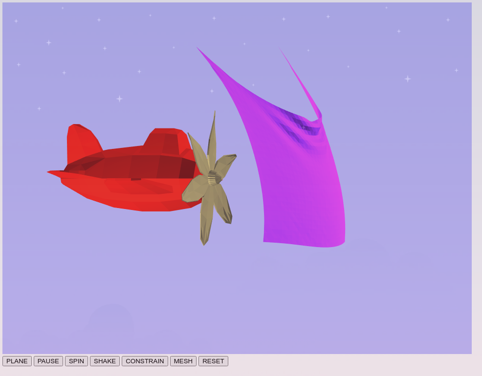

I think everything is working!

In particular, there's one fun extra thing, which is that there's support for
sinusoidal (or otherwise) varying the wind strength with time. Uncomment line
361 and comment line 362 of `cloth.js` to see this.

This one was a lot of fun. The one thing I wish I had time to do but didn't is
to apply some kind of subdivision to the cloth (maybe there's a way to track
the relationship of points to the original masses? the same scheme as last
project will probably be too slow if you have to recompute it every time), or
else do some kind of normal interpolation, because it does look a little
pixel-y right now.
